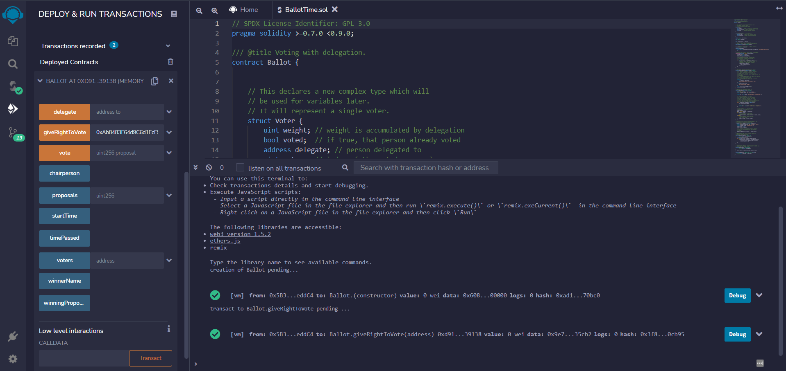

# Harmony zkDAO submission

Answers to the pre-requisite tasks for entering the summer 2022 Harmony zkDAO summit.

## Contracts
- [Store/Retrieve contract](https://github.com/Toki321/harmony-zkDAO-submission/blob/main/HelloWorld.sol)
- [Time Ballot contract with limited time for voting](https://github.com/Toki321/harmony-zkDAO-submission/blob/main/LimitedTimeBallot.sol)

### What is a smart contract? How are they deployed? You should be able to describe how a smart contract is deployed and the necessary steps.
  - Smart contracts are programs stored on a blockchain that run when predetermined conditions are met. Kind of like a digital version of a standard paper contract that automatically verifies fulfillment and performs the terms of the contract. A key feature is that they are immutable. 
  - To deploy a smart contract we first need to have some ETH to pay the gas fee for deploying the smart contract. The next step is to compile the smart contract, which will turn the code into bytecode that can be understood by the Ethereum blockchain. Then we create a contract address and call the constructor of the smart contract and initialize the contract on an address on the Ethereum blockchain. We also require access to an Ethereum node to transmit the transaction to the Ethereum network.

### What is gas? Why is gas optimization such a big focus when building smart contracts?
  - Gas refers to the fee, or pricing value, required to successfully conduct a transaction or execute a contract on the blockchain. Users pay gas because gas is needed to reward the miners/validators. Users can choose to pay more gas which will result in their transaction loading faster.
  - The better the gas optimization of a smart contract, the cheaper it will cost users to deploy it or interact with the contract. Complex smart contracts can be very expensive and that is not good especially for mainstream adoption, that is why gas optimization is of key importance.

### What is a hash? Why do people use hashing to hide information?
  - A hash is a one way function that takes an input of arbitrary length and gives an encrypted output of a fixed length. Key feature of hashes are:  
        ◦ No two input hashes should map to the same output hash  
        ◦ It should be difficult to guess the input value for a hash function from it’s output (almost impossible with cryptographic hashes)  
        ◦ Even slight changes of data changes the hash dramatically  
   - Because of these and other similar properties hashing is used in blockchain technology. Every block on the blockchain has a hash pointer that points to the hash of the data on the previous block. If a hacker attacks block 3, because of the properties of hash functions even the slight change of data changes the hash drastically, this means any change made in block 3 will change the hash stored in block 2. This in turn will change the hash and data on block 2 which will change it on block 1 and so on.. This is how blockchains remain immutable and why hashing are of key importance in blockchains.

### How would you prove to a colorblind person that two different colored objects are actually of different colors?
- Show him the object as the one you have to find and ask him to rearrange them while you don’t look. Then show him the same ball that you’re supposed to find. Repeat until the colorblind person is convinced.

### Program a super simple “Hello World” smart contract: write a storeNumber function to store an unsigned integer and then a retrieveNumber function to retrieve it. Clearly comment your code. Once completed, deploy the smart contract on remix. Push the .sol file to Github or Gist and include a screenshot of the Remix UI once deployed in your final submission pdf. 
- [Store/Retrieve contract](https://github.com/Toki321/harmony-zkDAO-submission/blob/main/HelloWorld.sol)

